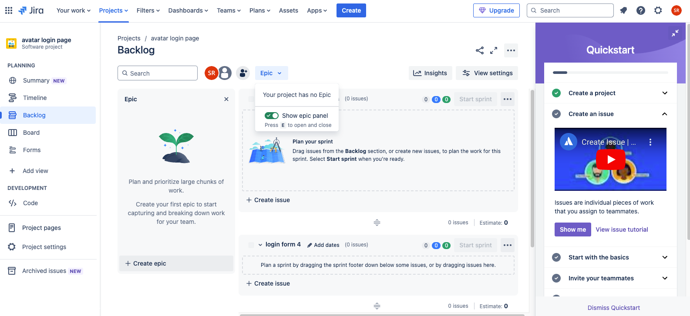

#  Create an Epic

An Epic is a large feature or set of tasks that can be broken down into smaller user stories. In this step, we’ll create an Epic for the **Home Page** of the Whitebox Learning project.

## 1. Navigate to Your Project:
- On your Jira dashboard, go to **Projects**, select “whitebox-learning”.

## 2. Create an Epic:
- Go to the **Backlog** section under the project.
- On the left-hand side, click on the **“Create Epic”** link.
- Alternatively, click **“Create Issue”**, then choose **Epic** from the dropdown.

## 3. Fill in the Epic Details:
- **Epic Name**: Enter **"Home Page"** for the Epic.
- **Epic Summary**: Provide a brief overview of the Epic’s goal. For example, “Create a homepage showcasing technologies like UI, ML, and QA.”
- **Priority**: Set the priority level (e.g., High, Medium, Low).
- **Due Date**: Set a due date for the Epic if applicable.
- **Assign the Epic**: Assign the Epic to the relevant person or team.

## 4. Create the Epic:
- After filling out the Epic details, click **Create** to add it to your project.

## User Story 1: 
**As a user, I want to view programming technologies on the homepage to select my learning track.**

### Tasks:
1. **Design the homepage UI with technology cards for UI, ML, and QA.**
   - Create wireframes and mockups for technology cards.
   - Ensure the design is visually appealing and aligns with the overall theme of the homepage.

2. **Fetch technology data dynamically using backend APIs.**
   - Implement API calls to retrieve data related to programming technologies (UI, ML, QA).
   - Ensure the data is displayed dynamically on the homepage without requiring a page reload.

3. **Add hover effects and clickable navigation to respective pages.**
   - Implement hover effects on technology cards (e.g., scaling, color changes).
   - Add clickable functionality to each technology card to navigate to respective detailed pages about the technologies.

# Examples #

### Epic Creation

| Epic Name                | Description                                                                                     |
|--------------------------|-------------------------------------------------------------------------------------------------|
| **Home Page**             | Create a homepage showcasing technologies like UI, ML, and QA.                                 |
| **Schedule Management**   | Develop functionality to schedule meetings, sessions, and mock interviews.                     |
| **Resources**             | Build subpages for accessing recordings, presentations, and resume-building tools.             |
| **Contact Page**          | Implement a contact form to communicate with WBL's recruitment team and display contact info.  |
| **User Authentication**   | Implement login, registration, profile management, and logout functionalities.                |

---

