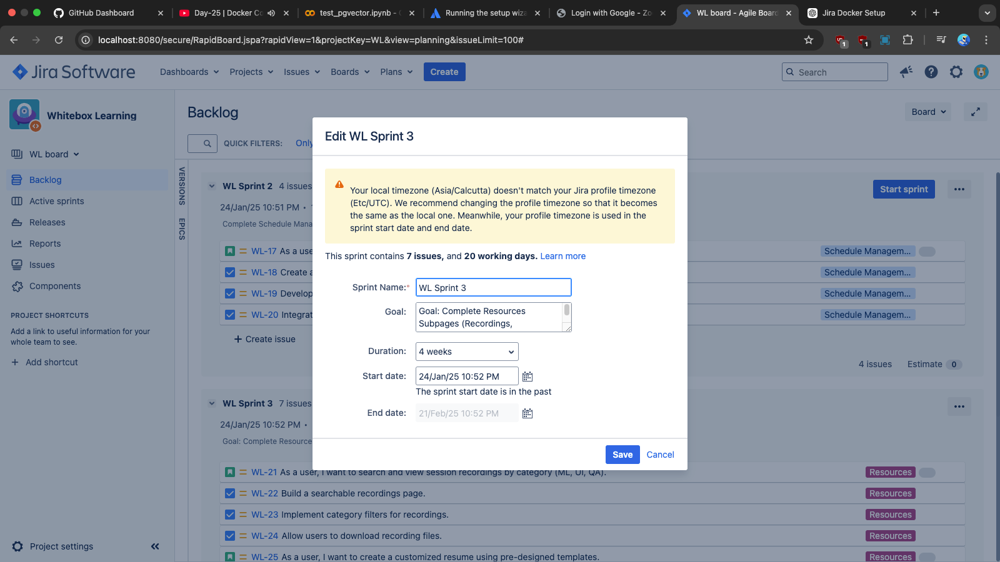

#  Prioritize Stories and Plan Sprint (if using Scrum)

## 1. Prioritize the Backlog:
- In the **Backlog** section, drag and drop the user stories to reorder them according to priority (High, Medium, Low).
- **High-priority** stories should be at the top of the list.

## 2. Create Sprint:
Organize your stories and tasks into sprints. For example:  
- **Sprint 1**: "Complete homepage and FAQ page."  
- **Sprint 2**: "Complete scheduling functionality."  
- **Sprint 3**: "Finish Resources subpages (Recordings, Resume Builder)."  

**Sprint 1**:
- Goal: Complete Home Page and FAQ Page.
- Tasks:
  - Design homepage UI.
  - Create FAQ structure and backend integration.
  - Test the FAQ page and resolve bugs.

**Sprint 2**:
- Goal: Complete Schedule Management.
- Tasks:
  - Develop scheduler interface.
  - Integrate email notifications for schedules.
  - Test and deploy scheduling features.

**Sprint 3**:
- Goal: Complete Resources Subpages (Recordings, Presentations, Resume Builder).
- Tasks:
  - Create a searchable recordings page.
  - Implement a resume builder tool.
  - Add filters and export options for resume creation.

## 3. Assign Stories to Sprint:
- After selecting the stories, click **Assign to Sprint** to include them in the active sprint.

## 4. Start Sprint:
- If using Scrum, select the stories you wish to work on in the upcoming sprint.  
- Click **Start Sprint**, define the sprint duration (e.g., 2 weeks), and start working on the stories.  
