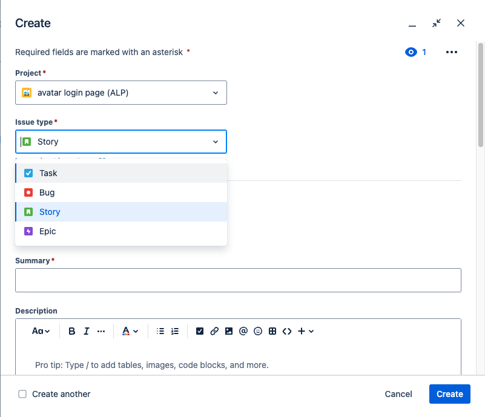

#  Create User Stories Under the Epic

User stories represent smaller, detailed pieces of work within an Epic. Here’s how to create stories under the Epic.

## 1. Create User Stories for Features:
- Go back to the **Backlog** section in your project.
- Click on **Create Issue**, and from the dropdown, select **Story**.
- **Story Title**: Enter a descriptive, user-friendly title for the story.

### Example Stories for the “whitebox-learning” project:
- “Create Home Page”
- “Develop Login Page”
- “Set up Registration Form”
- “Create Schedule Management”
- “Recording and User Media Page”

## 2. Link Stories to the Epic:
- After creating each story, link them to the Epic by selecting the **Epic Link** field and choosing the relevant Epic (e.g., “Whitebox Learning Development”).

## 3. Add Detailed Descriptions to Each Story:
- For each story, provide detailed descriptions outlining the work involved.

### Example for the “Create Home Page” story:
- “”

## 4. Assign Stories and Set Due Dates:
- Assign the stories to the relevant team members for implementation.
- Set due dates based on your project timeline or sprint schedule.

### User Stories

#### Epic: Home Page

**Story**: As a user, I want to view programming technologies on the homepage to select my learning track.
  - **Tasks**:
    1. Design the homepage UI with technology cards for UI, ML, and QA.
    2. Fetch technology data dynamically using backend APIs.
    3. Add hover effects and clickable navigation to respective pages.

**Story**: As a user, I want the homepage to load within 3 seconds for an optimal experience.
  - **Tasks**:
    1. Optimize homepage assets (images, CSS, JS).
    2. Implement lazy loading for images.
    3. Test and refine page performance using tools like Lighthouse.

---

#### Epic: Schedule Management

**Story**: As a user, I want to schedule mock interviews to practice and improve.
  - **Tasks**:
    1. Create a user-friendly scheduler interface.
    2. Develop APIs to store and retrieve scheduled events.
    3. Integrate email notifications for scheduled interviews.

**Story**: As a user, I want to view a list of my scheduled sessions.
  - **Tasks**:
    1. Create a list view for scheduled events.
    2. Add filtering by date and session type (mock, meeting, etc.).
    3. Allow users to reschedule or cancel events.

---

#### Epic: Resources

**Story**: As a user, I want to search and view session recordings by category (ML, UI, QA).
  - **Tasks**:
    1. Build a searchable recordings page.
    2. Implement category filters for recordings.
    3. Allow users to download recording files.

**Story**: As a user, I want to create a customized resume using pre-designed templates.
  - **Tasks**:
    1. Develop a resume builder tool with templates.
    2. Allow customization of sections (education, skills, experience).
    3. Add export functionality to download resumes as PDFs.

